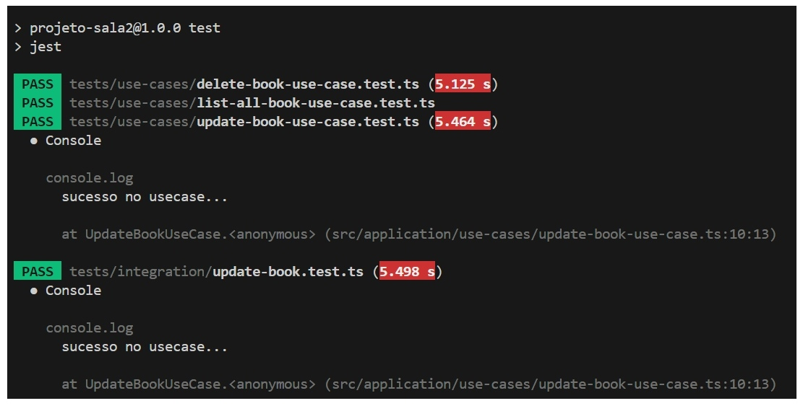
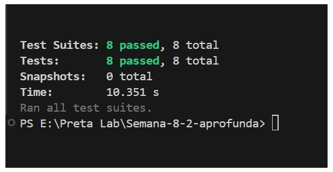

# O que Estudei Esta Semana: 📚🤓💻
Esta semana, mergulhei nos conceitos de Test Driven Development (TDD), aprendendo como implementar testes unitários e de integração de forma eficaz no desenvolvimento de software. O foco foi aplicar TDD no meu projeto de livros, utilizando as ferramentas Jest e SuperTest.


## Tarefa da semana

Implementar uma aplicação utilizando boas práticas de TDD, garantindo a confiabilidade do código por meio de testes unitários e de integração.

## Relação de Livros com Test Driven Development (TDD)

Este projeto foi desenvolvido como parte do módulo de **Test Driven Development (TDD)** do Aprofunda Preta Lab, com foco em criar uma aplicação para gerenciamento de livros, priorizando a escrita de testes antes do desenvolvimento dos casos de uso principais.


## 🧬 Conceitos de Test Driven Development (TDD)

TDD é uma metodologia de desenvolvimento que segue o ciclo:
1. **Escrever um teste que falha**: Antes de implementar qualquer funcionalidade, criamos testes que descrevem o comportamento esperado do código.
2. **Fazer o teste passar**: Desenvolver apenas o código necessário para que o teste passe.
3. **Refatorar**: Melhorar o código, mantendo os testes verdes.

Esse processo promove um desenvolvimento mais robusto e com menos bugs, facilitando a manutenção e refatoração do código.

## 🔨 Funcionalidades do Projeto

- **Adicionar Livros**: Permite criar novos livros com informações como título, autor, ano de publicação e status.
- **Listar Todos os Livros**: Recupera a lista completa de livros cadastrados.
- **Atualizar Livros**: Modifica informações de um livro existente.
- **Excluir Livros**: Remove um livro do sistema.

## 🛠️ Ferramentas Utilizadas

- **Jest**: Framework para testes unitários e de integração no Node.js.  
- **SuperTest**: Biblioteca utilizada para testar APIs HTTP.

## ✔️ Casos de Testes Implementados

Foram desenvolvidos testes unitários e de integração para validar os principais casos de uso do sistema:  
- **CreateBookUseCase**: Testes para verificar a criação de um livro, incluindo validações de campos obrigatórios.  
- **ListAllBooksUseCase**: Testes para garantir a recuperação de todos os livros cadastrados.  
- **UpdateBookUseCase**: Testes para validar a atualização de informações de um livro.  
- **DeleteBookUseCase**: Testes para garantir a remoção de um livro específico.


## Testes

```
  ├── integration
  │   ├── create-book.test.ts
  │   ├── delete-book.test.ts
  │   ├── list-all-books.test.ts  
  │   └── update-book.test.ts 
  └── use-cases
      ├── create-book-use-case.test.ts
      ├── delete-book-use-case.test.ts
      ├── list-all-book-use-case.test.ts
      └── update-book-use-case.test.ts 
```


## 📸 Resultados dos Testes


### Print 1  ⏬


### Print 2  ⏬


### Print 3  ⏬



## 🚀 Instalação e Configuração

1. Clone o repositório:  
   ```bash
   git clone https://github.com/DevFaBGirl/Semana-8-2-aprofunda.git
   ```
2. Instale as dependências:  
   ```bash
   npm install
   ```
3. Execute os testes:  
   ```bash
   npm run test
   ```